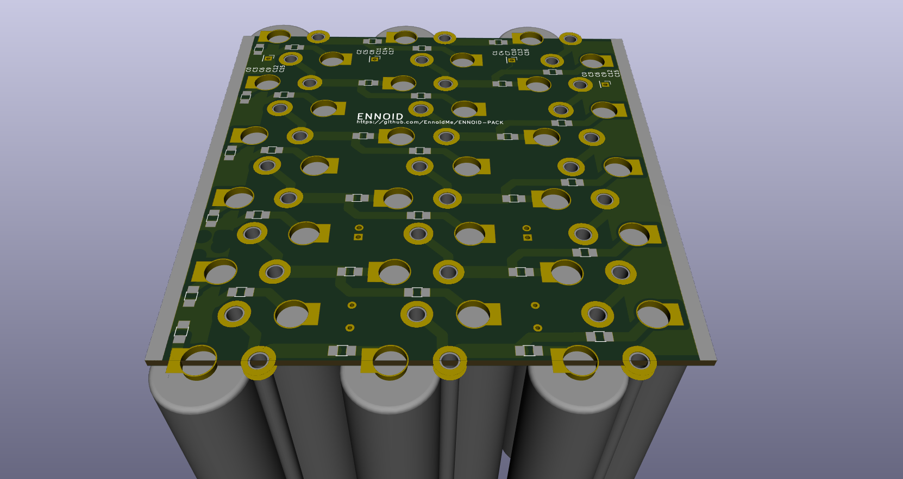
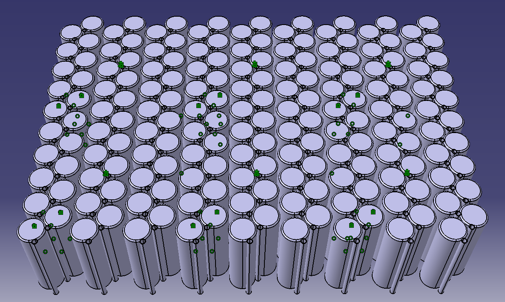
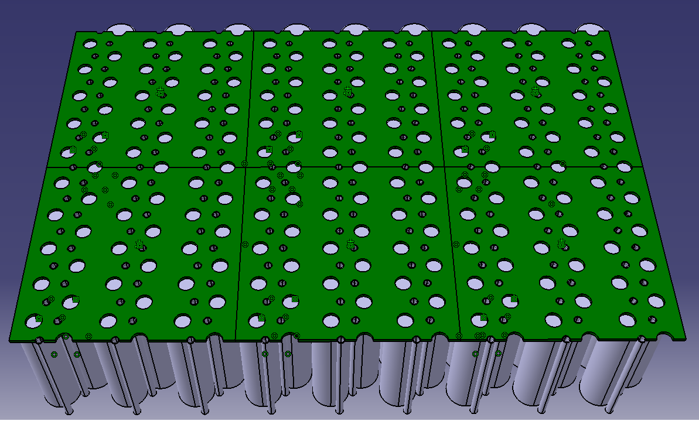

This repository is part of the open-source project: EVGE - Electric Vehicle Global Equipment:

- EVCE - Electric Vehicle Charge Equipment
  - Onboard Battery Charger
  - Charging station
- EVBE - Electric Vehicle Battery Equipment 
  - BMS (https://github.com/EnnoidMe/ENNOID-BMS)
  - **Scalable Battery Pack (This repository)**
- EVPE - Electric Vehicle Powertrain Equipment
  - Motor Driver (https://github.com/EnnoidMe/VESC-controller)
  - Gate driver (https://github.com/EnnoidMe/ENNOID-Dual-Gate-Driver)
  - Scalable Three-Phase Electric Motor

# ENNOID-PACK

This project aims to create a scalable & modular lithium-ion battery packs based on cylindrical cell format.

For small production & prototyping, PCB cost 4.90$ for 10pcs when smaller than 100mm x 100mm. Until the design prove itself functionnal, it is cheaper to use small 100 x 100mm PCBs connected together instead of ordering one huge & expensive PCB. For this reason, the design is now based on a modular approach.

## Features:

**18650 cells board**
- Vertically PCB mounted cells
- SMD fuse for each cell
- Integrated temperature probes & cell monitoring connectors for BMS
- Each cell is surrounded by three aluminium pins that act as pack structural reinforcement, negative electrode & heat dissipation.
- Positive electrode can be spotwelded directly to the PCB
- Can be both liquid cooled or air cooled
 

## Concept images:

