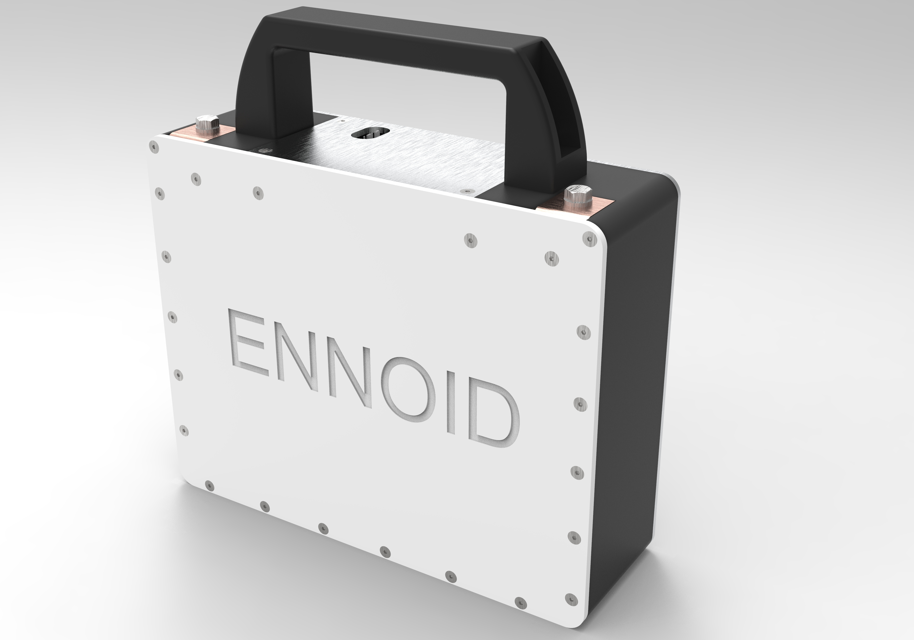
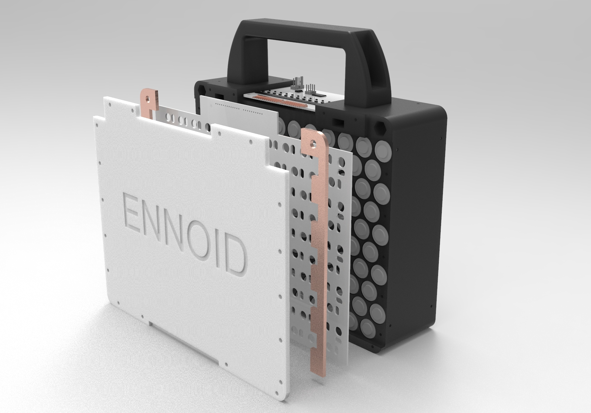
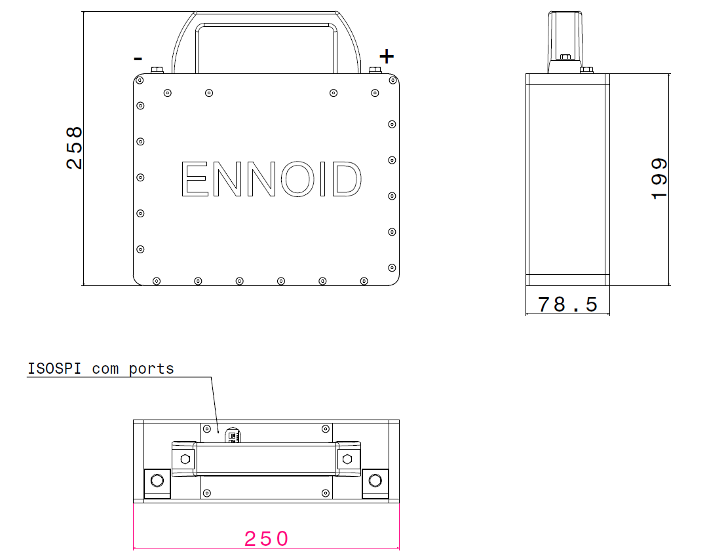

Related ENNOID projects:
  - [Onboard Battery Charger](https://github.com/EnnoidMe/ENNOID-Charger)
  - [BMS](https://github.com/EnnoidMe/ENNOID-BMS)
  - [Scalable Battery Pack](https://github.com/EnnoidMe/ENNOID-PACK)
  - [Motor Drive](https://github.com/EnnoidMe/VESC-controller)
  - [Dual Isolated Gate driver](https://github.com/EnnoidMe/ENNOID-Dual-Gate-Driver)

# ENNOID-PACK

This project aims to create a scalable & modular lithium-ion battery packs based on cylindrical cell format.

## Features:

- Cylindrical 18650 cells, 12S10P modules from 1kWh to 1,5kWh (power output & capacity depend of the cell type)
- Vertical cells with cooling plate on one side & a cells-PCB on the other side for cells connections.
- No wire assembly with cells-PCB directly connected to ENNOID-BMS slave board for voltages & temperatures monitoring
- Modules can be stacked in parallels & series
- ISOSPI communication toward ENNOID-BMS master board
- 3D printable plastic case with standard 3dprinter (220mm x 250mm)

Each module has an ENNOID-BMS slave board mounted below the handle for balancing. 

External master board with 12V power supply, contactors, current sensor & charger are required for a complete system.

Available for order:

https://www.ennoid.me/battery/battery-pack

12S10P modules rated at max. 1.5kWh, 100A continuous, 44.4V nomival:

