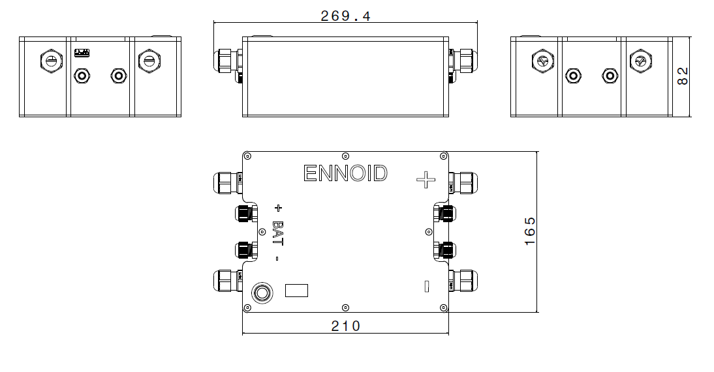

Related ENNOID projects:
  - [BMS](https://github.com/EnnoidMe/ENNOID-BMS)

# ENNOID-PACK

This project aims to create a scalable & modular lithium-ion battery packs based on cylindrical cell format.

## Features:

- Cylindrical cells
- Vertical cells with cooling plate on one side & a cells-PCB on the other side for cells connections.
- No wire assembly with cells-PCB directly connected to ENNOID-BMS slave board for voltages & temperatures monitoring
- Modules can be stacked in parallels & series
- ISOSPI communication toward ENNOID-BMS master board
- 3D printable plastic case

Each module has an ENNOID-BMS slave board mounted for balancing. 

For a complete battery pack system, master board with 12V power supply, contactors & current sensor are integrated in the separate "Penthouse box" 

Available for order:

https://www.ennoid.me/battery

View this project on [CADLAB.io](https://cadlab.io/project/1988). 
