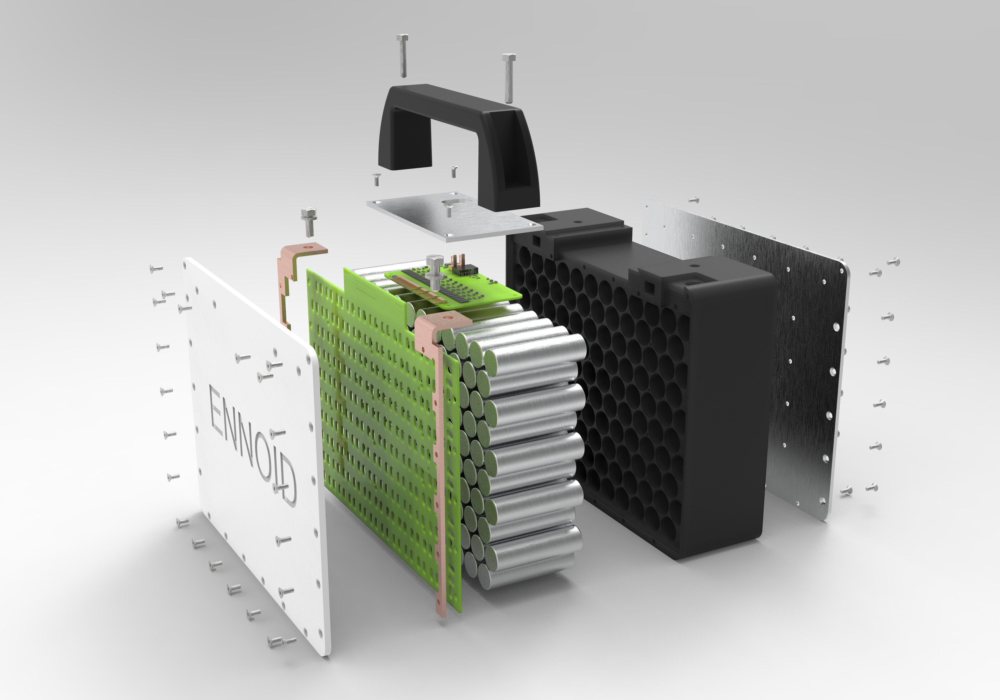

Related ENNOID projects:
  - [Onboard Battery Charger](https://github.com/EnnoidMe/ENNOID-Charger)
  - [BMS](https://github.com/EnnoidMe/ENNOID-BMS)
  - [Scalable Battery Pack](https://github.com/EnnoidMe/ENNOID-PACK)
  - [Motor Drive](https://github.com/EnnoidMe/VESC-controller)
  - [Dual Isolated Gate driver](https://github.com/EnnoidMe/ENNOID-Dual-Gate-Driver)

# ENNOID-PACK

This project aims to create a scalable & modular lithium-ion battery packs based on cylindrical cell format.

## Features:

- Cylindrical cells, 12S10P modular modules
- 1,5kWh modules can be stacked in parallels & series
- Integrated thermistor, cell voltages & temperature monitoring connectors for BMS are soldered onto the PCB
- Cells electrodes are spotwelded directly onto the PCB
- ISOSPI communication toward master BMS board
- Individually fused cylindrical cells
- Sealed, isolated & robust casing
- Integrated with ENNOID-BMS for voltages & temperatures monitoring

Available for order:
https://www.ennoid.me/battery/battery-pack

12S10P modules rated at 1.5kWh, 100A continuous, 44.4V nomival:

